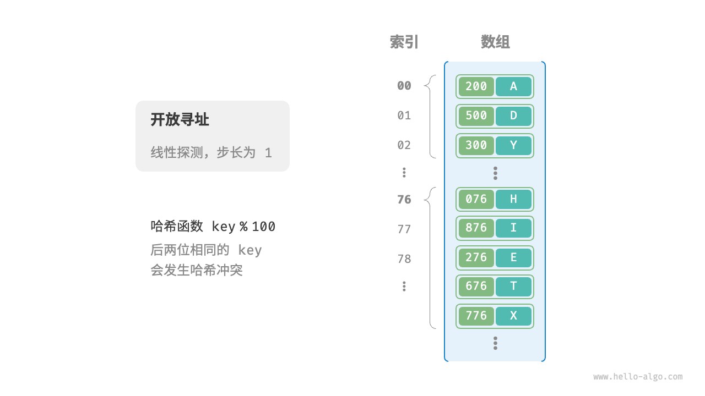
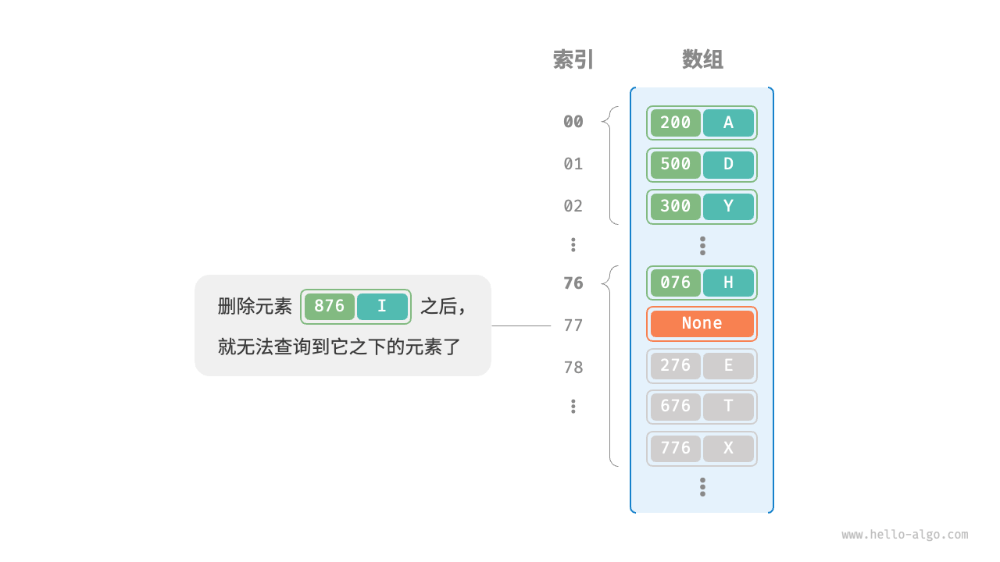

# Hash collision

As mentioned in the previous section, **usually the input space of a hash function is much larger than its output space**, making hash collisions theoretically inevitable. For example, if the input space consists of all integers and the output space is the size of the array capacity, multiple integers will inevitably map to the same bucket index.

Hash collisions can lead to incorrect query results, severely affecting the usability of hash tables. To solve this problem, we expand the hash table whenever a hash collision occurs, until the collision is resolved. This method is simple and effective but inefficient due to the extensive data transfer and hash value computation involved in resizing the hash table. To improve efficiency, we can adopt the following strategies:

1. Improve the data structure of the hash table, **allowing it to function normally in the event of a hash collision**.
2. Only perform resizing when necessary, i.e., when hash collisions are severe.

There are mainly two methods for improving the structure of hash tables: "Separate Chaining" and "Open Addressing".

## Separate chaining

In the original hash table, each bucket can store only one key-value pair. "Separate chaining" transforms individual elements into a linked list, with key-value pairs as list nodes, storing all colliding key-value pairs in the same list. The figure below shows an example of a hash table with separate chaining.


The operations of a hash table implemented with separate chaining have changed as follows:

- **Querying elements**: Input `key`, pass through the hash function to obtain the bucket index, access the head node of the list, then traverse the list and compare `key` to find the target key-value pair.
- **Adding elements**: First access the list head node via the hash function, then add the node (key-value pair) to the list.
- **Deleting elements**: Access the list head based on the hash function's result, then traverse the list to find and remove the target node.

Separate chaining has the following limitations:

- **Increased space usage**: The linked list contains node pointers, which consume more memory space than arrays.
- **Reduced query efficiency**: Due to the need for linear traversal of the list to find the corresponding element.

The code below provides a simple implementation of a separate chaining hash table, with two things to note:

- Lists (dynamic arrays) are used instead of linked lists for simplicity. In this setup, the hash table (array) contains multiple buckets, each of which is a list.
- This implementation includes a method for resizing the hash table. When the load factor exceeds $\frac{2}{3}$, we resize the hash table to twice its original size.

```src
[file]{hash_map_chaining}-[class]{hash_map_chaining}-[func]{}
```

It's worth noting that when the list is very long, the query efficiency $O(n)$ is poor. **At this point, the list can be converted to an "AVL tree" or "Red-Black tree"** to optimize the time complexity of the query operation to $O(\log n)$.

## Open addressing

"Open addressing" does not introduce additional data structures but uses "multiple probes" to handle hash collisions. The probing methods mainly include linear probing, quadratic probing, and double hashing.

Let's use linear probing as an example to introduce the mechanism of open addressing hash tables.

### Linear probing

Linear probing uses a fixed-step linear search for probing, differing from ordinary hash tables.

- **Inserting elements**: Calculate the bucket index using the hash function. If the bucket already contains an element, linearly traverse forward from the conflict position (usually with a step size of $1$) until an empty bucket is found, then insert the element.
- **Searching for elements**: If a hash collision is found, use the same step size to linearly traverse forward until the corresponding element is found and return `value`; if an empty bucket is encountered, it means the target element is not in the hash table, so return `None`.

The figure below shows the distribution of key-value pairs in an open addressing (linear probing) hash table. According to this hash function, keys with the same last two digits will be mapped to the same bucket. Through linear probing, they are stored consecutively in that bucket and the buckets below it.



However, **linear probing tends to create "clustering"**. Specifically, the longer a continuous position in the array is occupied, the more likely these positions are to encounter hash collisions, further promoting the growth of these clusters and eventually leading to deterioration in the efficiency of operations.

It's important to note that **we cannot directly delete elements in an open addressing hash table**. Deleting an element creates an empty bucket `None` in the array. When searching for elements, if linear probing encounters this empty bucket, it will return, making the elements below this bucket inaccessible. The program may incorrectly assume these elements do not exist, as shown in the figure below.



To solve this problem, we can use a "lazy deletion" mechanism: instead of directly removing elements from the hash table, **use a constant `TOMBSTONE` to mark the bucket**. In this mechanism, both `None` and `TOMBSTONE` represent empty buckets and can hold key-value pairs. However, when linear probing encounters `TOMBSTONE`, it should continue traversing since there may still be key-value pairs below it.

However, **lazy deletion may accelerate the degradation of hash table performance**. Every deletion operation produces a delete mark, and as `TOMBSTONE` increases, so does the search time, as linear probing may have to skip multiple `TOMBSTONE` to find the target element.

Therefore, consider recording the index of the first `TOMBSTONE` encountered during linear probing and swapping the target element found with this `TOMBSTONE`. The advantage of this is that each time a query or addition is performed, the element is moved to a bucket closer to the ideal position (starting point of probing), thereby optimizing the query efficiency.

The code below implements an open addressing (linear probing) hash table with lazy deletion. To make fuller use of the hash table space, we treat the hash table as a "circular array," continuing to traverse from the beginning when the end of the array is passed.

```src
[file]{hash_map_open_addressing}-[class]{hash_map_open_addressing}-[func]{}
```

### Quadratic probing

Quadratic probing is similar to linear probing and is one of the common strategies of open addressing. When a collision occurs, quadratic probing does not simply skip a fixed number of steps but skips "the square of the number of probes," i.e., $1, 4, 9, \dots$ steps.

Quadratic probing has the following advantages:

- Quadratic probing attempts to alleviate the clustering effect of linear probing by skipping the distance of the square of the number of probes.
- Quadratic probing skips larger distances to find empty positions, helping to distribute data more evenly.

However, quadratic probing is not perfect:

- Clustering still exists, i.e., some positions are more likely to be occupied than others.
- Due to the growth of squares, quadratic probing may not probe the entire hash table, meaning it might not access empty buckets even if they exist in the hash table.

### Double hashing

As the name suggests, the double hashing method uses multiple hash functions $f_1(x)$, $f_2(x)$, $f_3(x)$, $\dots$ for probing.

- **Inserting elements**: If hash function $f_1(x)$ encounters a conflict, try $f_2(x)$, and so on, until an empty position is found and the element is inserted.
- **Searching for elements**: Search in the same order of hash functions until the target element is found and returned; if an empty position is encountered or all hash functions have been tried, it indicates the element is not in the hash table, then return `None`.

Compared to linear probing, double hashing is less prone to clustering but involves additional computation for multiple hash functions.

!!! tip

    Please note that open addressing (linear probing, quadratic probing, and double hashing) hash tables all have the issue of "not being able to directly delete elements."

## Choice of programming languages

Various programming languages have adopted different hash table implementation strategies, here are a few examples:

- Python uses open addressing. The `dict` dictionary uses pseudo-random numbers for probing.
- Java uses separate chaining. Since JDK 1.8, when the array length in `HashMap` reaches 64 and the length of a linked list reaches 8, the linked list is converted to a red-black tree to improve search performance.
- Go uses separate chaining. Go stipulates that each bucket can store up to 8 key-value pairs, and if the capacity is exceeded, an overflow bucket is connected; when there are too many overflow buckets, a special equal-size expansion operation is performed to ensure performance.
