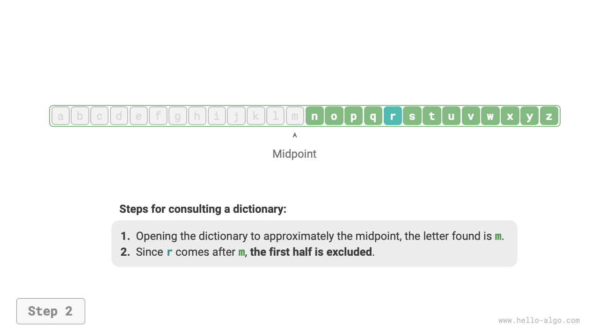

# Algorithms are everywhere

When we hear the word "algorithm," we naturally think of mathematics. However, many algorithms do not involve complex mathematics but rely more on basic logic, which can be seen everywhere in our daily lives.

Before formally discussing algorithms, there's an interesting fact worth sharing: **you have already unconsciously learned many algorithms and have become accustomed to applying them in your daily life**. Here, I will give a few specific examples to prove this point.

**Example 1: Looking Up a Dictionary**. In an English dictionary, words are listed alphabetically. Suppose we're searching for a word that starts with the letter $r$. This is typically done in the following way:

1. Open the dictionary to about halfway and check the first letter on the page, let's say the letter is $m$.
2. Since $r$ comes after $m$ in the alphabet, we can ignore the first half of the dictionary and focus on the latter half.
3. Repeat steps `1.` and `2.` until you find the page where the word starts with $r$.

=== "<1>"
    

=== "<2>"
    

=== "<3>"
    

=== "<4>"
    

=== "<5>"
    

This essential skill for elementary students, looking up a dictionary, is actually the famous "Binary Search" algorithm. From a data structure perspective, we can consider the dictionary as a sorted "array"; from an algorithmic perspective, the series of actions taken to look up a word in the dictionary can be viewed as "Binary Search."

**Example 2: Organizing Playing Cards**. When playing cards, we need to arrange the cards in our hand in ascending order, as shown in the following process.

1. Divide the playing cards into "ordered" and "unordered" sections, assuming initially the leftmost card is already in order.
2. Take out a card from the unordered section and insert it into the correct position in the ordered section; after this, the leftmost two cards are in order.
3. Continue to repeat step `2.` until all cards are in order.

The above method of organizing playing cards is essentially the "Insertion Sort" algorithm, which is very efficient for small datasets. Many programming languages' sorting functions include the insertion sort.

**Example 3: Making Change**. Suppose we buy goods worth $69$ yuan at a supermarket and give the cashier $100$ yuan, then the cashier needs to give us $31$ yuan in change. They would naturally complete the thought process as shown below.

1. The options are currencies smaller than $31$, including $1$, $5$, $10$, and $20$.
2. Take out the largest $20$ from the options, leaving $31 - 20 = 11$.
3. Take out the largest $10$ from the remaining options, leaving $11 - 10 = 1$.
4. Take out the largest $1$ from the remaining options, leaving $1 - 1 = 0$.
5. Complete the change-making, with the solution being $20 + 10 + 1 = 31$.

In the above steps, we make the best choice at each step (using the largest denomination possible), ultimately resulting in a feasible change-making plan. From the perspective of data structures and algorithms, this method is essentially a "Greedy" algorithm.

From cooking a meal to interstellar travel, almost all problem-solving involves algorithms. The advent of computers allows us to store data structures in memory and write code to call the CPU and GPU to execute algorithms. In this way, we can transfer real-life problems to computers, solving various complex issues more efficiently.

!!! tip

    If concepts such as data structures, algorithms, arrays, and binary search still seem somewhat obsecure, I encourage you to continue reading. This book will gently guide you into the realm of understanding data structures and algorithms.
