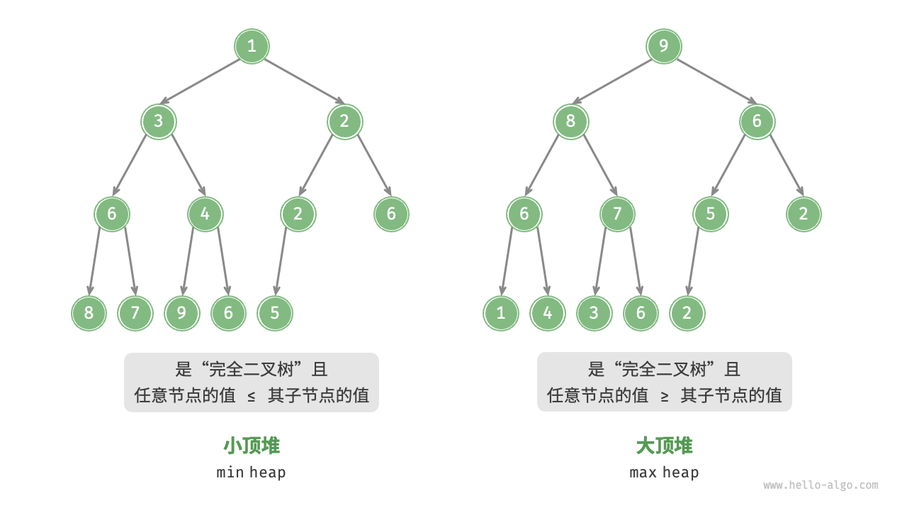
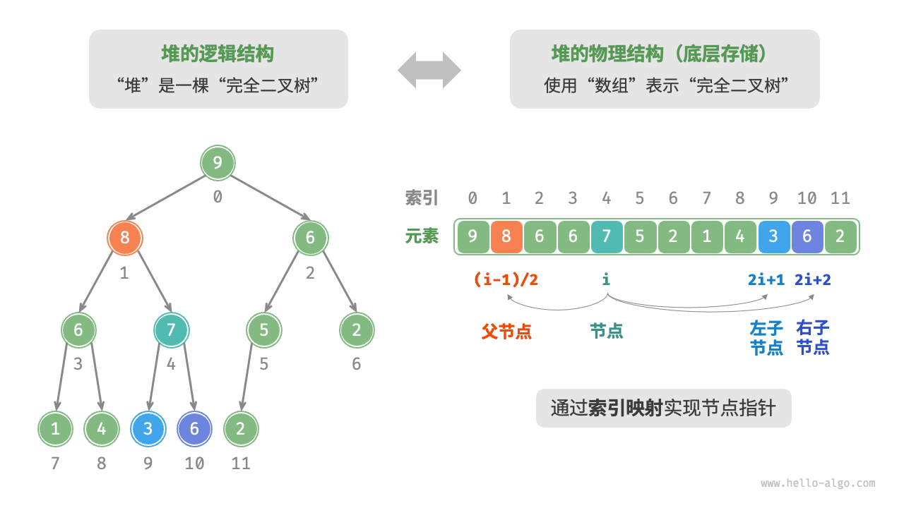
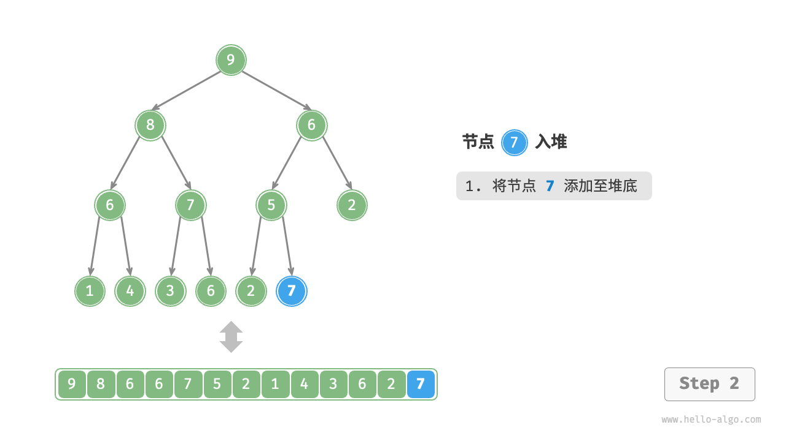
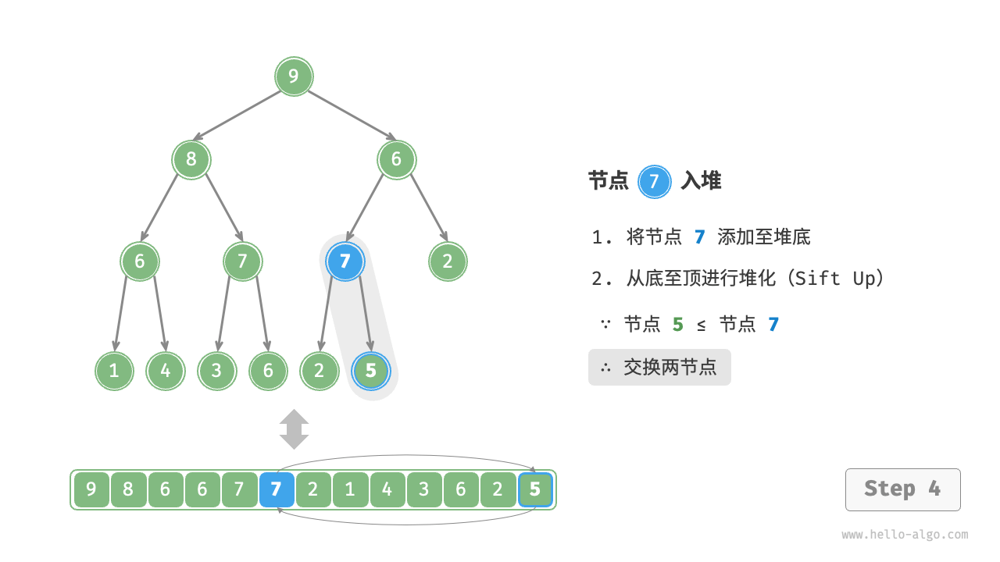
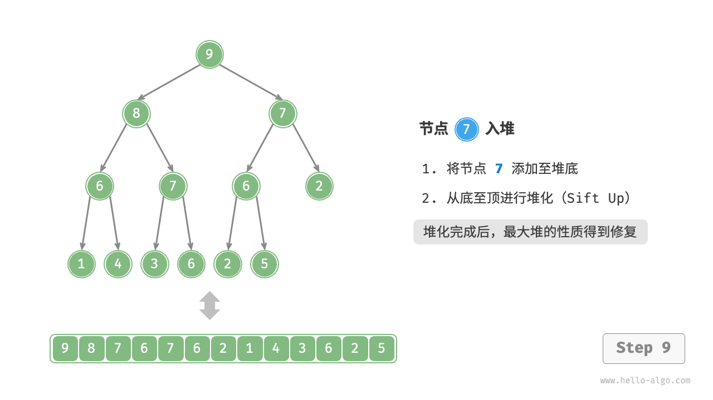
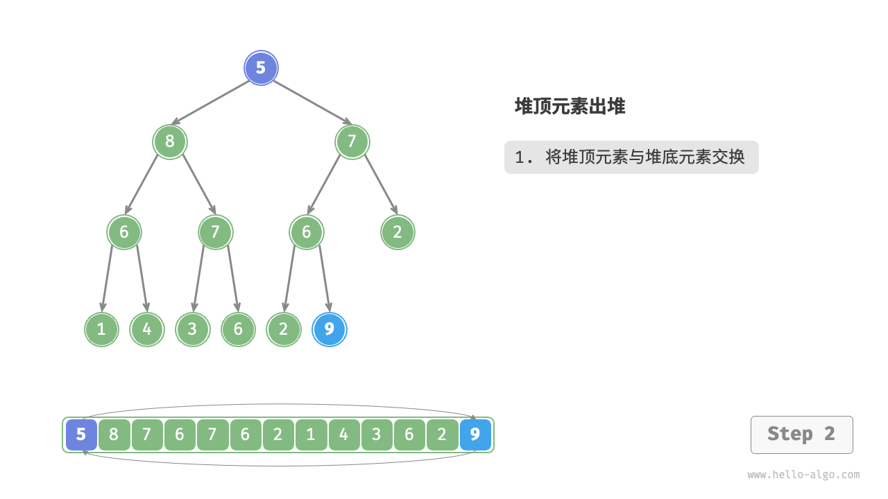
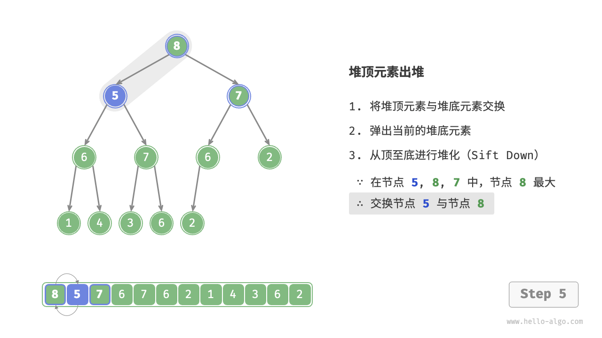
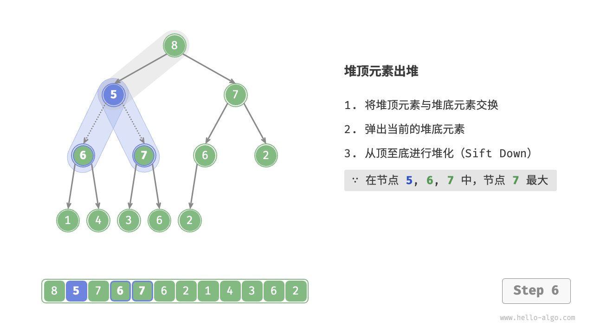
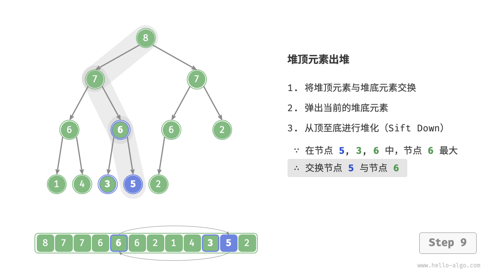
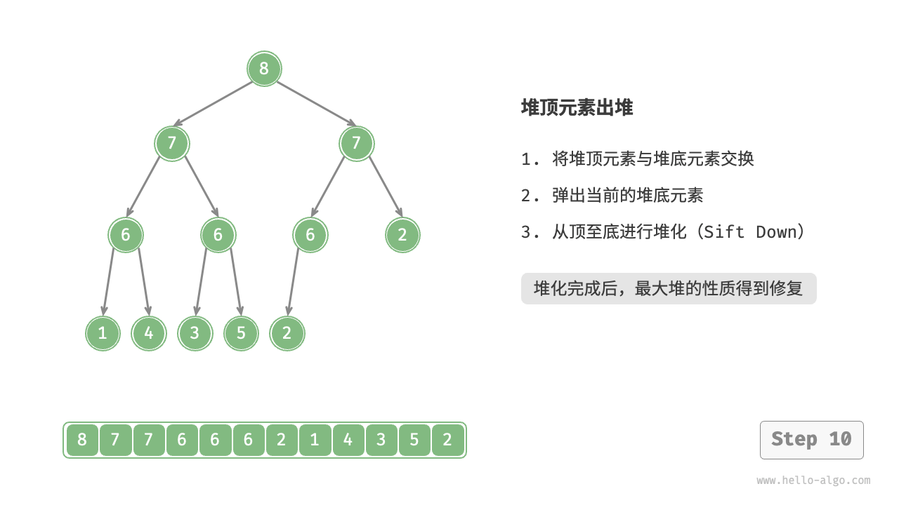

# Heap

A "heap" is a complete binary tree that satisfies specific conditions and can be mainly divided into two types, as shown in the figure below.

- "Min heap": The value of any node $\leq$ the values of its child nodes.
- "Max heap": The value of any node $\geq$ the values of its child nodes.



As a special case of a complete binary tree, heaps have the following characteristics:

- The bottom layer nodes are filled from left to right, and nodes in other layers are fully filled.
- The root node of the binary tree is called the "heap top," and the bottom-rightmost node is called the "heap bottom."
- For max heaps (min heaps), the value of the heap top element (root node) is the largest (smallest).

## Common operations on heaps

It should be noted that many programming languages provide a "priority queue," which is an abstract data structure defined as a queue with priority sorting.

In fact, **heaps are often used to implement priority queues, with max heaps equivalent to priority queues where elements are dequeued in descending order**. From a usage perspective, we can consider "priority queue" and "heap" as equivalent data structures. Therefore, this book does not make a special distinction between the two, uniformly referring to them as "heap."

Common operations on heaps are shown in the table below, and the method names depend on the programming language.

<p align="center"> Table <id> &nbsp; Efficiency of Heap Operations </p>

| Method name | Description                                                  | Time complexity |
| ----------- | ------------------------------------------------------------ | --------------- |
| `push()`    | Add an element to the heap                                   | $O(\log n)$     |
| `pop()`     | Remove the top element from the heap                         | $O(\log n)$     |
| `peek()`    | Access the top element (for max/min heap, the max/min value) | $O(1)$          |
| `size()`    | Get the number of elements in the heap                       | $O(1)$          |
| `isEmpty()` | Check if the heap is empty                                   | $O(1)$          |

In practice, we can directly use the heap class (or priority queue class) provided by programming languages.

Similar to sorting algorithms where we have "ascending order" and "descending order," we can switch between "min heap" and "max heap" by setting a `flag` or modifying the `Comparator`. The code is as follows:

=== "Python"

    ```python title="heap.py"
    # 初始化小顶堆
    min_heap, flag = [], 1
    # 初始化大顶堆
    max_heap, flag = [], -1

    # Python 的 heapq 模块默认实现小顶堆
    # 考虑将“元素取负”后再入堆，这样就可以将大小关系颠倒，从而实现大顶堆
    # 在本示例中，flag = 1 时对应小顶堆，flag = -1 时对应大顶堆

    # 元素入堆
    heapq.heappush(max_heap, flag * 1)
    heapq.heappush(max_heap, flag * 3)
    heapq.heappush(max_heap, flag * 2)
    heapq.heappush(max_heap, flag * 5)
    heapq.heappush(max_heap, flag * 4)

    # 获取堆顶元素
    peek: int = flag * max_heap[0] # 5

    # 堆顶元素出堆
    # 出堆元素会形成一个从大到小的序列
    val = flag * heapq.heappop(max_heap) # 5
    val = flag * heapq.heappop(max_heap) # 4
    val = flag * heapq.heappop(max_heap) # 3
    val = flag * heapq.heappop(max_heap) # 2
    val = flag * heapq.heappop(max_heap) # 1

    # 获取堆大小
    size: int = len(max_heap)

    # 判断堆是否为空
    is_empty: bool = not max_heap

    # 输入列表并建堆
    min_heap: list[int] = [1, 3, 2, 5, 4]
    heapq.heapify(min_heap)
    ```

=== "C++"

    ```cpp title="heap.cpp"
    /* 初始化堆 */
    // 初始化小顶堆
    priority_queue<int, vector<int>, greater<int>> minHeap;
    // 初始化大顶堆
    priority_queue<int, vector<int>, less<int>> maxHeap;

    /* 元素入堆 */
    maxHeap.push(1);
    maxHeap.push(3);
    maxHeap.push(2);
    maxHeap.push(5);
    maxHeap.push(4);

    /* 获取堆顶元素 */
    int peek = maxHeap.top(); // 5

    /* 堆顶元素出堆 */
    // 出堆元素会形成一个从大到小的序列
    maxHeap.pop(); // 5
    maxHeap.pop(); // 4
    maxHeap.pop(); // 3
    maxHeap.pop(); // 2
    maxHeap.pop(); // 1

    /* 获取堆大小 */
    int size = maxHeap.size();

    /* 判断堆是否为空 */
    bool isEmpty = maxHeap.empty();

    /* 输入列表并建堆 */
    vector<int> input{1, 3, 2, 5, 4};
    priority_queue<int, vector<int>, greater<int>> minHeap(input.begin(), input.end());
    ```

=== "Java"

    ```java title="heap.java"
    /* 初始化堆 */
    // 初始化小顶堆
    Queue<Integer> minHeap = new PriorityQueue<>();
    // 初始化大顶堆（使用 lambda 表达式修改 Comparator 即可）
    Queue<Integer> maxHeap = new PriorityQueue<>((a, b) -> b - a);
    
    /* 元素入堆 */
    maxHeap.offer(1);
    maxHeap.offer(3);
    maxHeap.offer(2);
    maxHeap.offer(5);
    maxHeap.offer(4);
    
    /* 获取堆顶元素 */
    int peek = maxHeap.peek(); // 5
    
    /* 堆顶元素出堆 */
    // 出堆元素会形成一个从大到小的序列
    peek = maxHeap.poll(); // 5
    peek = maxHeap.poll(); // 4
    peek = maxHeap.poll(); // 3
    peek = maxHeap.poll(); // 2
    peek = maxHeap.poll(); // 1
    
    /* 获取堆大小 */
    int size = maxHeap.size();
    
    /* 判断堆是否为空 */
    boolean isEmpty = maxHeap.isEmpty();
    
    /* 输入列表并建堆 */
    minHeap = new PriorityQueue<>(Arrays.asList(1, 3, 2, 5, 4));
    ```

=== "C#"

    ```csharp title="heap.cs"
    /* 初始化堆 */
    // 初始化小顶堆
    PriorityQueue<int, int> minHeap = new();
    // 初始化大顶堆（使用 lambda 表达式修改 Comparator 即可）
    PriorityQueue<int, int> maxHeap = new(Comparer<int>.Create((x, y) => y - x));

    /* 元素入堆 */
    maxHeap.Enqueue(1, 1);
    maxHeap.Enqueue(3, 3);
    maxHeap.Enqueue(2, 2);
    maxHeap.Enqueue(5, 5);
    maxHeap.Enqueue(4, 4);

    /* 获取堆顶元素 */
    int peek = maxHeap.Peek();//5

    /* 堆顶元素出堆 */
    // 出堆元素会形成一个从大到小的序列
    peek = maxHeap.Dequeue();  // 5
    peek = maxHeap.Dequeue();  // 4
    peek = maxHeap.Dequeue();  // 3
    peek = maxHeap.Dequeue();  // 2
    peek = maxHeap.Dequeue();  // 1

    /* 获取堆大小 */
    int size = maxHeap.Count;

    /* 判断堆是否为空 */
    bool isEmpty = maxHeap.Count == 0;

    /* 输入列表并建堆 */
    minHeap = new PriorityQueue<int, int>([(1, 1), (3, 3), (2, 2), (5, 5), (4, 4)]);
    ```

=== "Go"

    ```go title="heap.go"
    // Go 语言中可以通过实现 heap.Interface 来构建整数大顶堆
    // 实现 heap.Interface 需要同时实现 sort.Interface
    type intHeap []any

    // Push heap.Interface 的方法，实现推入元素到堆
    func (h *intHeap) Push(x any) {
        // Push 和 Pop 使用 pointer receiver 作为参数
        // 因为它们不仅会对切片的内容进行调整，还会修改切片的长度。
        *h = append(*h, x.(int))
    }

    // Pop heap.Interface 的方法，实现弹出堆顶元素
    func (h *intHeap) Pop() any {
        // 待出堆元素存放在最后
        last := (*h)[len(*h)-1]
        *h = (*h)[:len(*h)-1]
        return last
    }

    // Len sort.Interface 的方法
    func (h *intHeap) Len() int {
        return len(*h)
    }

    // Less sort.Interface 的方法
    func (h *intHeap) Less(i, j int) bool {
        // 如果实现小顶堆，则需要调整为小于号
        return (*h)[i].(int) > (*h)[j].(int)
    }

    // Swap sort.Interface 的方法
    func (h *intHeap) Swap(i, j int) {
        (*h)[i], (*h)[j] = (*h)[j], (*h)[i]
    }

    // Top 获取堆顶元素
    func (h *intHeap) Top() any {
        return (*h)[0]
    }

    /* Driver Code */
    func TestHeap(t *testing.T) {
        /* 初始化堆 */
        // 初始化大顶堆
        maxHeap := &intHeap{}
        heap.Init(maxHeap)
        /* 元素入堆 */
        // 调用 heap.Interface 的方法，来添加元素
        heap.Push(maxHeap, 1)
        heap.Push(maxHeap, 3)
        heap.Push(maxHeap, 2)
        heap.Push(maxHeap, 4)
        heap.Push(maxHeap, 5)

        /* 获取堆顶元素 */
        top := maxHeap.Top()
        fmt.Printf("堆顶元素为 %d\n", top)

        /* 堆顶元素出堆 */
        // 调用 heap.Interface 的方法，来移除元素
        heap.Pop(maxHeap) // 5
        heap.Pop(maxHeap) // 4
        heap.Pop(maxHeap) // 3
        heap.Pop(maxHeap) // 2
        heap.Pop(maxHeap) // 1

        /* 获取堆大小 */
        size := len(*maxHeap)
        fmt.Printf("堆元素数量为 %d\n", size)

        /* 判断堆是否为空 */
        isEmpty := len(*maxHeap) == 0
        fmt.Printf("堆是否为空 %t\n", isEmpty)
    }
    ```

=== "Swift"

    ```swift title="heap.swift"
    /* 初始化堆 */
    // Swift 的 Heap 类型同时支持最大堆和最小堆，且需要引入 swift-collections
    var heap = Heap<Int>()

    /* 元素入堆 */
    heap.insert(1)
    heap.insert(3)
    heap.insert(2)
    heap.insert(5)
    heap.insert(4)

    /* 获取堆顶元素 */
    var peek = heap.max()!

    /* 堆顶元素出堆 */
    peek = heap.removeMax() // 5
    peek = heap.removeMax() // 4
    peek = heap.removeMax() // 3
    peek = heap.removeMax() // 2
    peek = heap.removeMax() // 1

    /* 获取堆大小 */
    let size = heap.count

    /* 判断堆是否为空 */
    let isEmpty = heap.isEmpty

    /* 输入列表并建堆 */
    let heap2 = Heap([1, 3, 2, 5, 4])
    ```

=== "JS"

    ```javascript title="heap.js"
    // JavaScript 未提供内置 Heap 类
    ```

=== "TS"

    ```typescript title="heap.ts"
    // TypeScript 未提供内置 Heap 类
    ```

=== "Dart"

    ```dart title="heap.dart"
    // Dart 未提供内置 Heap 类
    ```

=== "Rust"

    ```rust title="heap.rs"
    use std::collections::BinaryHeap;
    use std::cmp::Reverse;

    /* 初始化堆 */
    // 初始化小顶堆
    let mut min_heap = BinaryHeap::<Reverse<i32>>::new();
    // 初始化大顶堆
    let mut max_heap = BinaryHeap::new();

    /* 元素入堆 */
    max_heap.push(1);
    max_heap.push(3);
    max_heap.push(2);
    max_heap.push(5);
    max_heap.push(4);
    
    /* 获取堆顶元素 */
    let peek = max_heap.peek().unwrap();  // 5

    /* 堆顶元素出堆 */
    // 出堆元素会形成一个从大到小的序列
    let peek = max_heap.pop().unwrap();   // 5
    let peek = max_heap.pop().unwrap();   // 4
    let peek = max_heap.pop().unwrap();   // 3
    let peek = max_heap.pop().unwrap();   // 2
    let peek = max_heap.pop().unwrap();   // 1

    /* 获取堆大小 */
    let size = max_heap.len();

    /* 判断堆是否为空 */
    let is_empty = max_heap.is_empty();

    /* 输入列表并建堆 */
    let min_heap = BinaryHeap::from(vec![Reverse(1), Reverse(3), Reverse(2), Reverse(5), Reverse(4)]);
    ```

=== "C"

    ```c title="heap.c"
    // C 未提供内置 Heap 类
    ```

=== "Kotlin"

    ```kotlin title="heap.kt"
    /* 初始化堆 */
    // 初始化小顶堆
    var minHeap = PriorityQueue<Int>()
    // 初始化大顶堆（使用 lambda 表达式修改 Comparator 即可）
    val maxHeap = PriorityQueue { a: Int, b: Int -> b - a }
    
    /* 元素入堆 */
    maxHeap.offer(1)
    maxHeap.offer(3)
    maxHeap.offer(2)
    maxHeap.offer(5)
    maxHeap.offer(4)
    
    /* 获取堆顶元素 */
    var peek = maxHeap.peek() // 5
    
    /* 堆顶元素出堆 */
    // 出堆元素会形成一个从大到小的序列
    peek = maxHeap.poll() // 5
    peek = maxHeap.poll() // 4
    peek = maxHeap.poll() // 3
    peek = maxHeap.poll() // 2
    peek = maxHeap.poll() // 1
    
    /* 获取堆大小 */
    val size = maxHeap.size
    
    /* 判断堆是否为空 */
    val isEmpty = maxHeap.isEmpty()
    
    /* 输入列表并建堆 */
    minHeap = PriorityQueue(mutableListOf(1, 3, 2, 5, 4))
    ```

=== "Ruby"

    ```ruby title="heap.rb"

    ```

=== "Zig"

    ```zig title="heap.zig"

    ```

??? pythontutor "可视化运行"

    https://pythontutor.com/render.html#code=import%20heapq%0A%0A%22%22%22Driver%20Code%22%22%22%0Aif%20__name__%20%3D%3D%20%22__main__%22%3A%0A%20%20%20%20%23%20%E5%88%9D%E5%A7%8B%E5%8C%96%E5%B0%8F%E9%A1%B6%E5%A0%86%0A%20%20%20%20min_heap,%20flag%20%3D%20%5B%5D,%201%0A%20%20%20%20%23%20%E5%88%9D%E5%A7%8B%E5%8C%96%E5%A4%A7%E9%A1%B6%E5%A0%86%0A%20%20%20%20max_heap,%20flag%20%3D%20%5B%5D,%20-1%0A%20%20%20%20%0A%20%20%20%20%23%20Python%20%E7%9A%84%20heapq%20%E6%A8%A1%E5%9D%97%E9%BB%98%E8%AE%A4%E5%AE%9E%E7%8E%B0%E5%B0%8F%E9%A1%B6%E5%A0%86%0A%20%20%20%20%23%20%E8%80%83%E8%99%91%E5%B0%86%E2%80%9C%E5%85%83%E7%B4%A0%E5%8F%96%E8%B4%9F%E2%80%9D%E5%90%8E%E5%86%8D%E5%85%A5%E5%A0%86%EF%BC%8C%E8%BF%99%E6%A0%B7%E5%B0%B1%E5%8F%AF%E4%BB%A5%E5%B0%86%E5%A4%A7%E5%B0%8F%E5%85%B3%E7%B3%BB%E9%A2%A0%E5%80%92%EF%BC%8C%E4%BB%8E%E8%80%8C%E5%AE%9E%E7%8E%B0%E5%A4%A7%E9%A1%B6%E5%A0%86%0A%20%20%20%20%23%20%E5%9C%A8%E6%9C%AC%E7%A4%BA%E4%BE%8B%E4%B8%AD%EF%BC%8Cflag%20%3D%201%20%E6%97%B6%E5%AF%B9%E5%BA%94%E5%B0%8F%E9%A1%B6%E5%A0%86%EF%BC%8Cflag%20%3D%20-1%20%E6%97%B6%E5%AF%B9%E5%BA%94%E5%A4%A7%E9%A1%B6%E5%A0%86%0A%20%20%20%20%0A%20%20%20%20%23%20%E5%85%83%E7%B4%A0%E5%85%A5%E5%A0%86%0A%20%20%20%20heapq.heappush%28max_heap,%20flag%20*%201%29%0A%20%20%20%20heapq.heappush%28max_heap,%20flag%20*%203%29%0A%20%20%20%20heapq.heappush%28max_heap,%20flag%20*%202%29%0A%20%20%20%20heapq.heappush%28max_heap,%20flag%20*%205%29%0A%20%20%20%20heapq.heappush%28max_heap,%20flag%20*%204%29%0A%20%20%20%20%0A%20%20%20%20%23%20%E8%8E%B7%E5%8F%96%E5%A0%86%E9%A1%B6%E5%85%83%E7%B4%A0%0A%20%20%20%20peek%20%3D%20flag%20*%20max_heap%5B0%5D%20%23%205%0A%20%20%20%20%0A%20%20%20%20%23%20%E5%A0%86%E9%A1%B6%E5%85%83%E7%B4%A0%E5%87%BA%E5%A0%86%0A%20%20%20%20%23%20%E5%87%BA%E5%A0%86%E5%85%83%E7%B4%A0%E4%BC%9A%E5%BD%A2%E6%88%90%E4%B8%80%E4%B8%AA%E4%BB%8E%E5%A4%A7%E5%88%B0%E5%B0%8F%E7%9A%84%E5%BA%8F%E5%88%97%0A%20%20%20%20val%20%3D%20flag%20*%20heapq.heappop%28max_heap%29%20%23%205%0A%20%20%20%20val%20%3D%20flag%20*%20heapq.heappop%28max_heap%29%20%23%204%0A%20%20%20%20val%20%3D%20flag%20*%20heapq.heappop%28max_heap%29%20%23%203%0A%20%20%20%20val%20%3D%20flag%20*%20heapq.heappop%28max_heap%29%20%23%202%0A%20%20%20%20val%20%3D%20flag%20*%20heapq.heappop%28max_heap%29%20%23%201%0A%20%20%20%20%0A%20%20%20%20%23%20%E8%8E%B7%E5%8F%96%E5%A0%86%E5%A4%A7%E5%B0%8F%0A%20%20%20%20size%20%3D%20len%28max_heap%29%0A%20%20%20%20%0A%20%20%20%20%23%20%E5%88%A4%E6%96%AD%E5%A0%86%E6%98%AF%E5%90%A6%E4%B8%BA%E7%A9%BA%0A%20%20%20%20is_empty%20%3D%20not%20max_heap%0A%20%20%20%20%0A%20%20%20%20%23%20%E8%BE%93%E5%85%A5%E5%88%97%E8%A1%A8%E5%B9%B6%E5%BB%BA%E5%A0%86%0A%20%20%20%20min_heap%20%3D%20%5B1,%203,%202,%205,%204%5D%0A%20%20%20%20heapq.heapify%28min_heap%29&cumulative=false&curInstr=3&heapPrimitives=nevernest&mode=display&origin=opt-frontend.js&py=311&rawInputLstJSON=%5B%5D&textReferences=false

## Implementation of heaps

The following implementation is of a max heap. To convert it into a min heap, simply invert all size logic comparisons (for example, replace $\geq$ with $\leq$). Interested readers are encouraged to implement it on their own.

### Storage and representation of heaps

As mentioned in the "Binary Trees" section, complete binary trees are well-suited for array representation. Since heaps are a type of complete binary tree, **we will use arrays to store heaps**.

When using an array to represent a binary tree, elements represent node values, and indexes represent node positions in the binary tree. **Node pointers are implemented through an index mapping formula**.

As shown in the figure below, given an index $i$, the index of its left child is $2i + 1$, the index of its right child is $2i + 2$, and the index of its parent is $(i - 1) / 2$ (floor division). When the index is out of bounds, it signifies a null node or the node does not exist.



We can encapsulate the index mapping formula into functions for convenient later use:

```src
[file]{my_heap}-[class]{max_heap}-[func]{parent}
```

### Accessing the top element of the heap

The top element of the heap is the root node of the binary tree, which is also the first element of the list:

```src
[file]{my_heap}-[class]{max_heap}-[func]{peek}
```

### Inserting an element into the heap

Given an element `val`, we first add it to the bottom of the heap. After addition, since `val` may be larger than other elements in the heap, the heap's integrity might be compromised, **thus it's necessary to repair the path from the inserted node to the root node**. This operation is called "heapifying".

Considering starting from the node inserted, **perform heapify from bottom to top**. As shown in the figure below, we compare the value of the inserted node with its parent node, and if the inserted node is larger, we swap them. Then continue this operation, repairing each node in the heap from bottom to top until passing the root node or encountering a node that does not need to be swapped.

=== "<1>"
    

=== "<2>"
    

=== "<3>"
    

=== "<4>"
    

=== "<5>"
    

=== "<6>"
    

=== "<7>"
    

=== "<8>"
    

=== "<9>"
    

Given a total of $n$ nodes, the height of the tree is $O(\log n)$. Hence, the loop iterations for the heapify operation are at most $O(\log n)$, **making the time complexity of the element insertion operation $O(\log n)$**. The code is as shown:

```src
[file]{my_heap}-[class]{max_heap}-[func]{sift_up}
```

### Removing the top element from the heap

The top element of the heap is the root node of the binary tree, that is, the first element of the list. If we directly remove the first element from the list, all node indexes in the binary tree would change, making it difficult to use heapify for repairs subsequently. To minimize changes in element indexes, we use the following steps.

1. Swap the top element with the bottom element of the heap (swap the root node with the rightmost leaf node).
2. After swapping, remove the bottom of the heap from the list (note, since it has been swapped, what is actually being removed is the original top element).
3. Starting from the root node, **perform heapify from top to bottom**.

As shown in the figure below, **the direction of "heapify from top to bottom" is opposite to "heapify from bottom to top"**. We compare the value of the root node with its two children and swap it with the largest child. Then repeat this operation until passing the leaf node or encountering a node that does not need to be swapped.

=== "<1>"
    

=== "<2>"
    

=== "<3>"
    

=== "<4>"
    

=== "<5>"
    

=== "<6>"
    

=== "<7>"
    

=== "<8>"
    

=== "<9>"
    

=== "<10>"
    

Similar to the element insertion operation, the time complexity of the top element removal operation is also $O(\log n)$. The code is as follows:

```src
[file]{my_heap}-[class]{max_heap}-[func]{sift_down}
```

## Common applications of heaps

- **Priority Queue**: Heaps are often the preferred data structure for implementing priority queues, with both enqueue and dequeue operations having a time complexity of $O(\log n)$, and building a queue having a time complexity of $O(n)$, all of which are very efficient.
- **Heap Sort**: Given a set of data, we can create a heap from them and then continually perform element removal operations to obtain ordered data. However, we usually use a more elegant method to implement heap sort, as detailed in the "Heap Sort" section.
- **Finding the Largest $k$ Elements**: This is a classic algorithm problem and also a typical application, such as selecting the top 10 hot news for Weibo hot search, picking the top 10 selling products, etc.
