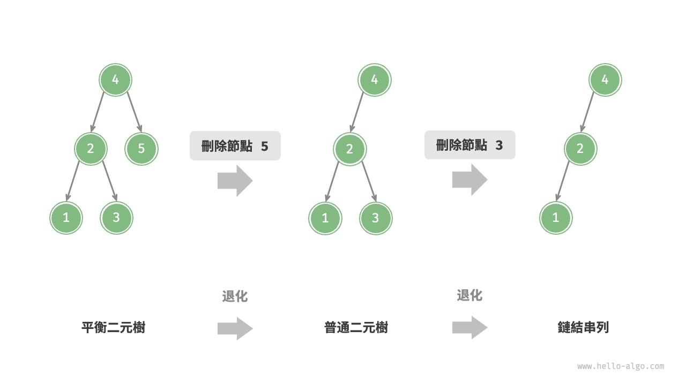
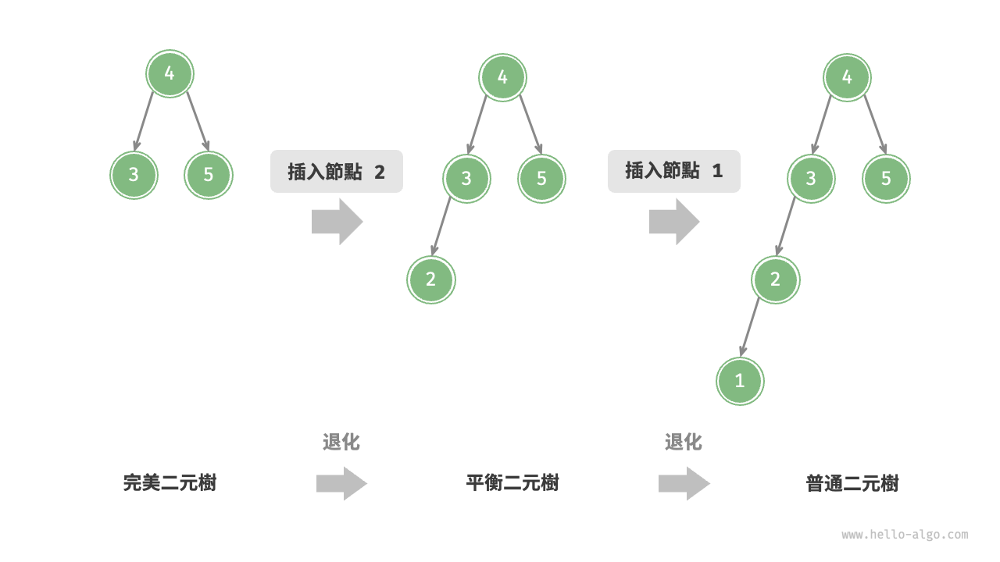
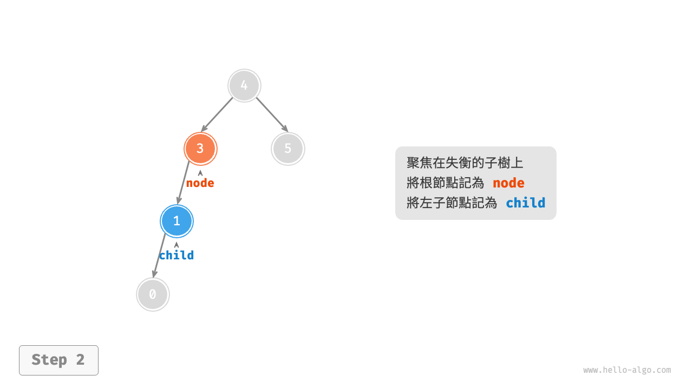
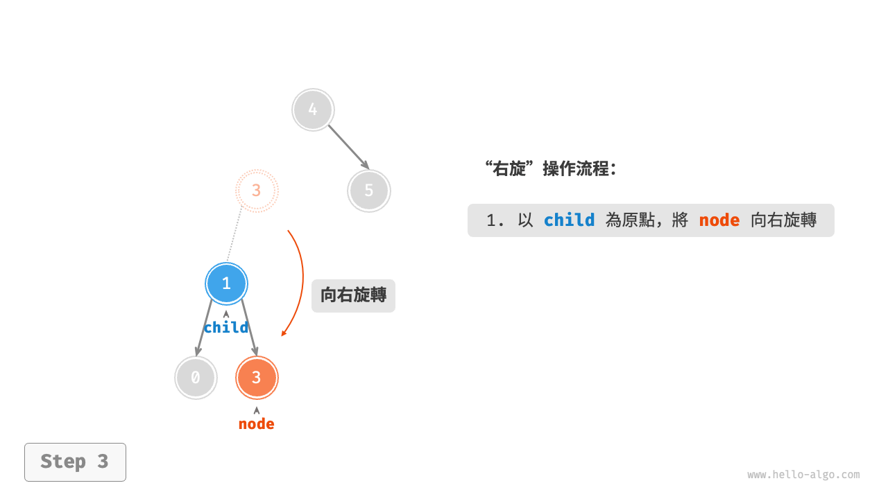
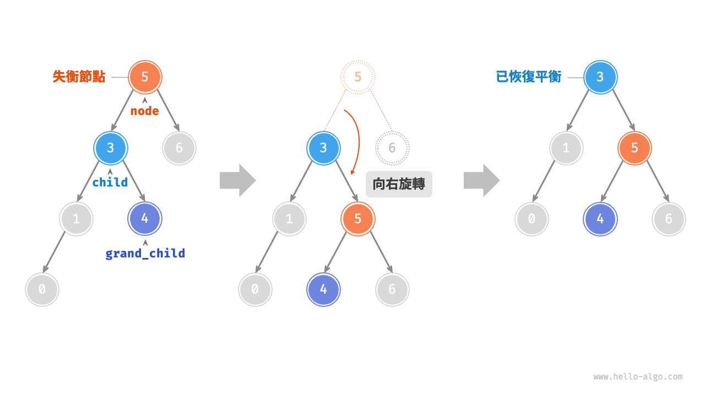
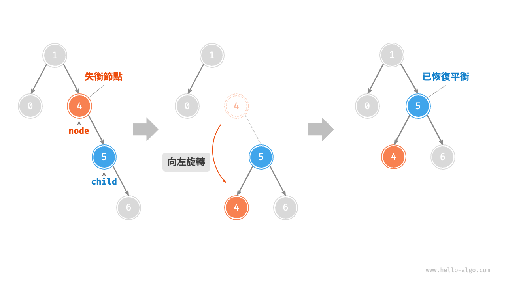
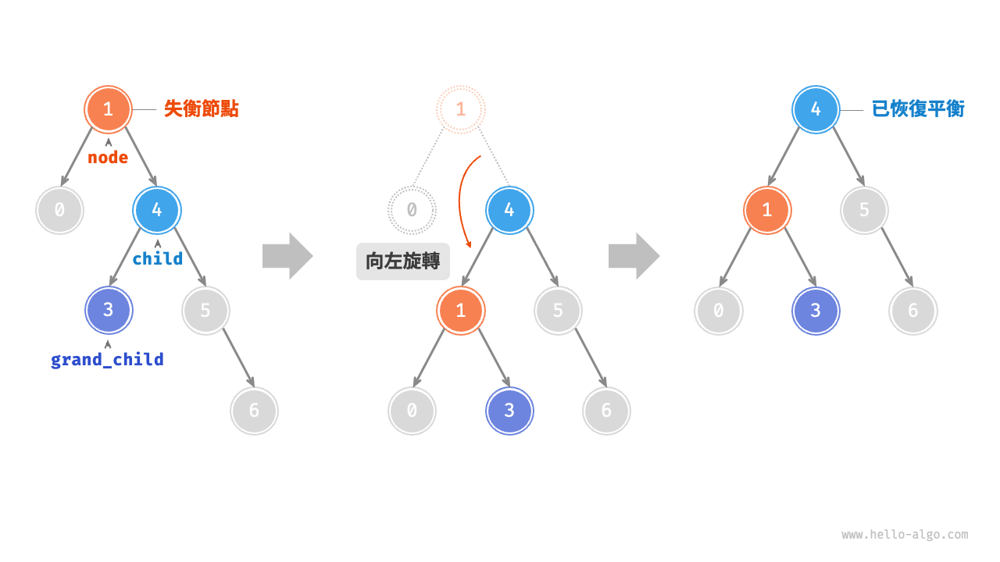
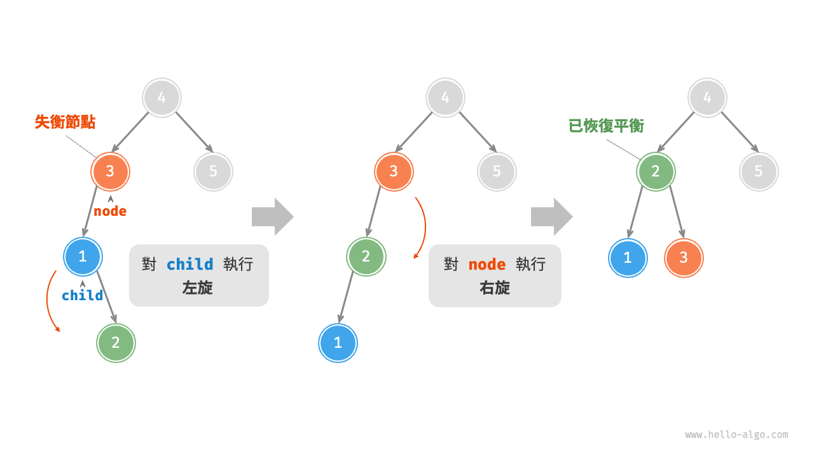

# AVL 樹 *

在“二元搜尋樹”章節中我們提到，在多次插入和刪除操作後，二元搜尋樹可能退化為鏈結串列。在這種情況下，所有操作的時間複雜度將從 $O(\log n)$ 劣化為 $O(n)$ 。

如下圖所示，經過兩次刪除節點操作，這棵二元搜尋樹便會退化為鏈結串列。



再例如，在下圖所示的完美二元樹中插入兩個節點後，樹將嚴重向左傾斜，查詢操作的時間複雜度也隨之劣化。



1962 年 G. M. Adelson-Velsky 和 E. M. Landis 在論文“An algorithm for the organization of information”中提出了 <u>AVL 樹</u>。論文中詳細描述了一系列操作，確保在持續新增和刪除節點後，AVL 樹不會退化，從而使得各種操作的時間複雜度保持在 $O(\log n)$ 級別。換句話說，在需要頻繁進行增刪查改操作的場景中，AVL 樹能始終保持高效的資料操作效能，具有很好的應用價值。

## AVL 樹常見術語

AVL 樹既是二元搜尋樹，也是平衡二元樹，同時滿足這兩類二元樹的所有性質，因此是一種<u>平衡二元搜尋樹（balanced binary search tree）</u>。

### 節點高度

由於 AVL 樹的相關操作需要獲取節點高度，因此我們需要為節點類別新增 `height` 變數：

=== "Python"

    ```python title=""
    class TreeNode:
        """AVL 樹節點類別"""
        def __init__(self, val: int):
            self.val: int = val                 # 節點值
            self.height: int = 0                # 節點高度
            self.left: TreeNode | None = None   # 左子節點引用
            self.right: TreeNode | None = None  # 右子節點引用
    ```

=== "C++"

    ```cpp title=""
    /* AVL 樹節點類別 */
    struct TreeNode {
        int val{};          // 節點值
        int height = 0;     // 節點高度
        TreeNode *left{};   // 左子節點
        TreeNode *right{};  // 右子節點
        TreeNode() = default;
        explicit TreeNode(int x) : val(x){}
    };
    ```

=== "Java"

    ```java title=""
    /* AVL 樹節點類別 */
    class TreeNode {
        public int val;        // 節點值
        public int height;     // 節點高度
        public TreeNode left;  // 左子節點
        public TreeNode right; // 右子節點
        public TreeNode(int x) { val = x; }
    }
    ```

=== "C#"

    ```csharp title=""
    /* AVL 樹節點類別 */
    class TreeNode(int? x) {
        public int? val = x;    // 節點值
        public int height;      // 節點高度
        public TreeNode? left;  // 左子節點引用
        public TreeNode? right; // 右子節點引用
    }
    ```

=== "Go"

    ```go title=""
    /* AVL 樹節點結構體 */
    type TreeNode struct {
        Val    int       // 節點值
        Height int       // 節點高度
        Left   *TreeNode // 左子節點引用
        Right  *TreeNode // 右子節點引用
    }
    ```

=== "Swift"

    ```swift title=""
    /* AVL 樹節點類別 */
    class TreeNode {
        var val: Int // 節點值
        var height: Int // 節點高度
        var left: TreeNode? // 左子節點
        var right: TreeNode? // 右子節點

        init(x: Int) {
            val = x
            height = 0
        }
    }
    ```

=== "JS"

    ```javascript title=""
    /* AVL 樹節點類別 */
    class TreeNode {
        val; // 節點值
        height; //節點高度
        left; // 左子節點指標
        right; // 右子節點指標
        constructor(val, left, right, height) {
            this.val = val === undefined ? 0 : val;
            this.height = height === undefined ? 0 : height;
            this.left = left === undefined ? null : left;
            this.right = right === undefined ? null : right;
        }
    }
    ```

=== "TS"

    ```typescript title=""
    /* AVL 樹節點類別 */
    class TreeNode {
        val: number;            // 節點值
        height: number;         // 節點高度
        left: TreeNode | null;  // 左子節點指標
        right: TreeNode | null; // 右子節點指標
        constructor(val?: number, height?: number, left?: TreeNode | null, right?: TreeNode | null) {
            this.val = val === undefined ? 0 : val;
            this.height = height === undefined ? 0 : height;
            this.left = left === undefined ? null : left;
            this.right = right === undefined ? null : right;
        }
    }
    ```

=== "Dart"

    ```dart title=""
    /* AVL 樹節點類別 */
    class TreeNode {
      int val;         // 節點值
      int height;      // 節點高度
      TreeNode? left;  // 左子節點
      TreeNode? right; // 右子節點
      TreeNode(this.val, [this.height = 0, this.left, this.right]);
    }
    ```

=== "Rust"

    ```rust title=""
    use std::rc::Rc;
    use std::cell::RefCell;

    /* AVL 樹節點結構體 */
    struct TreeNode {
        val: i32,                               // 節點值
        height: i32,                            // 節點高度
        left: Option<Rc<RefCell<TreeNode>>>,    // 左子節點
        right: Option<Rc<RefCell<TreeNode>>>,   // 右子節點
    }

    impl TreeNode {
        /* 建構子 */
        fn new(val: i32) -> Rc<RefCell<Self>> {
            Rc::new(RefCell::new(Self {
                val,
                height: 0,
                left: None,
                right: None
            }))
        }
    }
    ```

=== "C"

    ```c title=""
    /* AVL 樹節點結構體 */
    TreeNode struct TreeNode {
        int val;
        int height;
        struct TreeNode *left;
        struct TreeNode *right;
    } TreeNode;

    /* 建構子 */
    TreeNode *newTreeNode(int val) {
        TreeNode *node;

        node = (TreeNode *)malloc(sizeof(TreeNode));
        node->val = val;
        node->height = 0;
        node->left = NULL;
        node->right = NULL;
        return node;
    }
    ```

=== "Kotlin"

    ```kotlin title=""
    /* AVL 樹節點類別 */
    class TreeNode(val _val: Int) {  // 節點值
        val height: Int = 0          // 節點高度
        val left: TreeNode? = null   // 左子節點
        val right: TreeNode? = null  // 右子節點
    }
    ```

=== "Ruby"

    ```ruby title=""
    ### AVL 樹節點類別 ###
    class TreeNode
      attr_accessor :val    # 節點值
      attr_accessor :height # 節點高度
      attr_accessor :left   # 左子節點引用
      attr_accessor :right  # 右子節點引用

      def initialize(val)
        @val = val
        @height = 0
      end
    end
    ```

=== "Zig"

    ```zig title=""

    ```

“節點高度”是指從該節點到它的最遠葉節點的距離，即所經過的“邊”的數量。需要特別注意的是，葉節點的高度為 $0$ ，而空節點的高度為 $-1$ 。我們將建立兩個工具函式，分別用於獲取和更新節點的高度：

```src
[file]{avl_tree}-[class]{avl_tree}-[func]{update_height}
```

### 節點平衡因子

節點的<u>平衡因子（balance factor）</u>定義為節點左子樹的高度減去右子樹的高度，同時規定空節點的平衡因子為 $0$ 。我們同樣將獲取節點平衡因子的功能封裝成函式，方便後續使用：

```src
[file]{avl_tree}-[class]{avl_tree}-[func]{balance_factor}
```

!!! note

    設平衡因子為 $f$ ，則一棵 AVL 樹的任意節點的平衡因子皆滿足 $-1 \le f \le 1$ 。

## AVL 樹旋轉

AVL 樹的特點在於“旋轉”操作，它能夠在不影響二元樹的中序走訪序列的前提下，使失衡節點重新恢復平衡。換句話說，**旋轉操作既能保持“二元搜尋樹”的性質，也能使樹重新變為“平衡二元樹”**。

我們將平衡因子絕對值 $> 1$ 的節點稱為“失衡節點”。根據節點失衡情況的不同，旋轉操作分為四種：右旋、左旋、先右旋後左旋、先左旋後右旋。下面詳細介紹這些旋轉操作。

### 右旋

如下圖所示，節點下方為平衡因子。從底至頂看，二元樹中首個失衡節點是“節點 3”。我們關注以該失衡節點為根節點的子樹，將該節點記為 `node` ，其左子節點記為 `child` ，執行“右旋”操作。完成右旋後，子樹恢復平衡，並且仍然保持二元搜尋樹的性質。

=== "<1>"
    

=== "<2>"
    

=== "<3>"
    

=== "<4>"
    

如下圖所示，當節點 `child` 有右子節點（記為 `grand_child` ）時，需要在右旋中新增一步：將 `grand_child` 作為 `node` 的左子節點。



“向右旋轉”是一種形象化的說法，實際上需要透過修改節點指標來實現，程式碼如下所示：

```src
[file]{avl_tree}-[class]{avl_tree}-[func]{right_rotate}
```

### 左旋

相應地，如果考慮上述失衡二元樹的“映象”，則需要執行下圖所示的“左旋”操作。



同理，如下圖所示，當節點 `child` 有左子節點（記為 `grand_child` ）時，需要在左旋中新增一步：將 `grand_child` 作為 `node` 的右子節點。



可以觀察到，**右旋和左旋操作在邏輯上是映象對稱的，它們分別解決的兩種失衡情況也是對稱的**。基於對稱性，我們只需將右旋的實現程式碼中的所有的 `left` 替換為 `right` ，將所有的 `right` 替換為 `left` ，即可得到左旋的實現程式碼：

```src
[file]{avl_tree}-[class]{avl_tree}-[func]{left_rotate}
```

### 先左旋後右旋

對於下圖中的失衡節點 3 ，僅使用左旋或右旋都無法使子樹恢復平衡。此時需要先對 `child` 執行“左旋”，再對 `node` 執行“右旋”。



### 先右旋後左旋

如下圖所示，對於上述失衡二元樹的映象情況，需要先對 `child` 執行“右旋”，再對 `node` 執行“左旋”。


### 旋轉的選擇

下圖展示的四種失衡情況與上述案例逐個對應，分別需要採用右旋、先左旋後右旋、先右旋後左旋、左旋的操作。


如下表所示，我們透過判斷失衡節點的平衡因子以及較高一側子節點的平衡因子的正負號，來確定失衡節點屬於上圖中的哪種情況。

<p align="center"> 表 <id> &nbsp; 四種旋轉情況的選擇條件 </p>

| 失衡節點的平衡因子 | 子節點的平衡因子 | 應採用的旋轉方法 |
| ------------------ | ---------------- | ---------------- |
| $> 1$ （左偏樹）   | $\geq 0$         | 右旋             |
| $> 1$ （左偏樹）   | $<0$             | 先左旋後右旋     |
| $< -1$ （右偏樹）  | $\leq 0$         | 左旋             |
| $< -1$ （右偏樹）  | $>0$             | 先右旋後左旋     |

為了便於使用，我們將旋轉操作封裝成一個函式。**有了這個函式，我們就能對各種失衡情況進行旋轉，使失衡節點重新恢復平衡**。程式碼如下所示：

```src
[file]{avl_tree}-[class]{avl_tree}-[func]{rotate}
```

## AVL 樹常用操作

### 插入節點

AVL 樹的節點插入操作與二元搜尋樹在主體上類似。唯一的區別在於，在 AVL 樹中插入節點後，從該節點到根節點的路徑上可能會出現一系列失衡節點。因此，**我們需要從這個節點開始，自底向上執行旋轉操作，使所有失衡節點恢復平衡**。程式碼如下所示：

```src
[file]{avl_tree}-[class]{avl_tree}-[func]{insert_helper}
```

### 刪除節點

類似地，在二元搜尋樹的刪除節點方法的基礎上，需要從底至頂執行旋轉操作，使所有失衡節點恢復平衡。程式碼如下所示：

```src
[file]{avl_tree}-[class]{avl_tree}-[func]{remove_helper}
```

### 查詢節點

AVL 樹的節點查詢操作與二元搜尋樹一致，在此不再贅述。

## AVL 樹典型應用

- 組織和儲存大型資料，適用於高頻查詢、低頻增刪的場景。
- 用於構建資料庫中的索引系統。
- 紅黑樹也是一種常見的平衡二元搜尋樹。相較於 AVL 樹，紅黑樹的平衡條件更寬鬆，插入與刪除節點所需的旋轉操作更少，節點增刪操作的平均效率更高。
